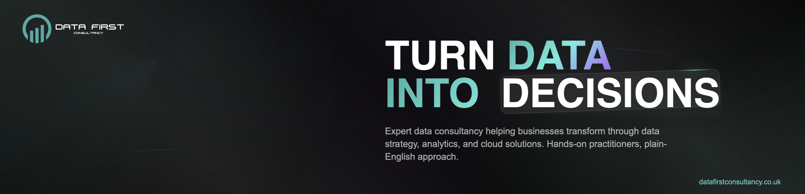

At Data First Consultancy, we are passionate about transforming businesses through the power of data and technology. Founded with a vision to democratise access to advanced analytics and digital solutions, we help organisations of all sizes unlock their potential and drive meaningful growth.

What drives us is the opportunity to see our clients succeed. Whether it's implementing AI-powered analytics, optimising operations through data insights, or building scalable digital infrastructure, we're committed to delivering results that make a real difference to your bottom line.

## 🚀 Core Services

| 🏗️ **Data Engineering & Architecture** | 🤖 **Data Science & AI** | 📊 **Business Intelligence** |
|:---:|:---:|:---:|
| Robust data pipelines, scalable architectures, and efficient data management solutions | Predictive analytics, machine learning models, and AI-powered automation | Comprehensive BI solutions for data-driven decision making |

| ☁️ **Cloud Solutions** | 🔒 **Cybersecurity** | 🎯 **Data Strategy** |
|:---:|:---:|:---:|
| Cloud-first solutions, migration, and multi-cloud architecture | Enterprise-grade security, threat detection, and risk management | Strategic consulting, governance frameworks, and transformation planning |

